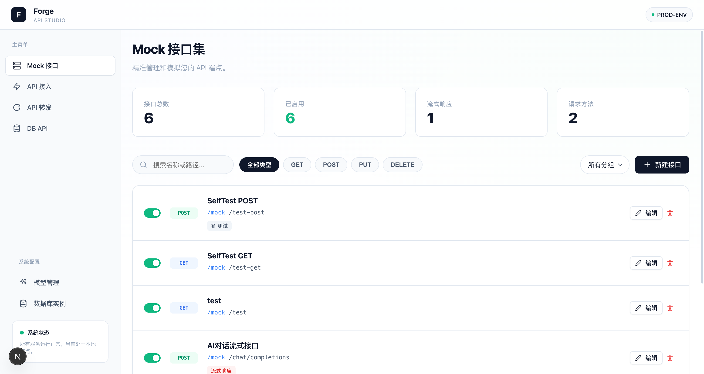
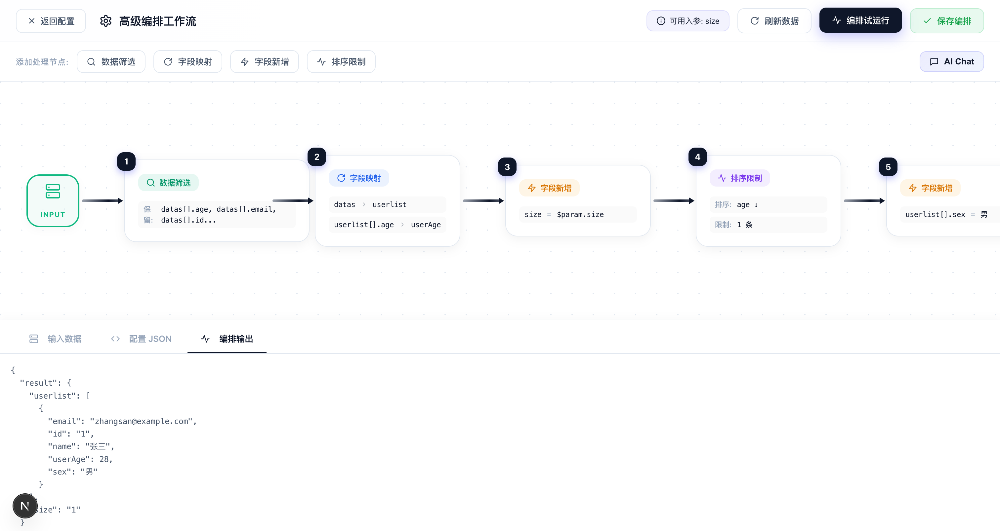
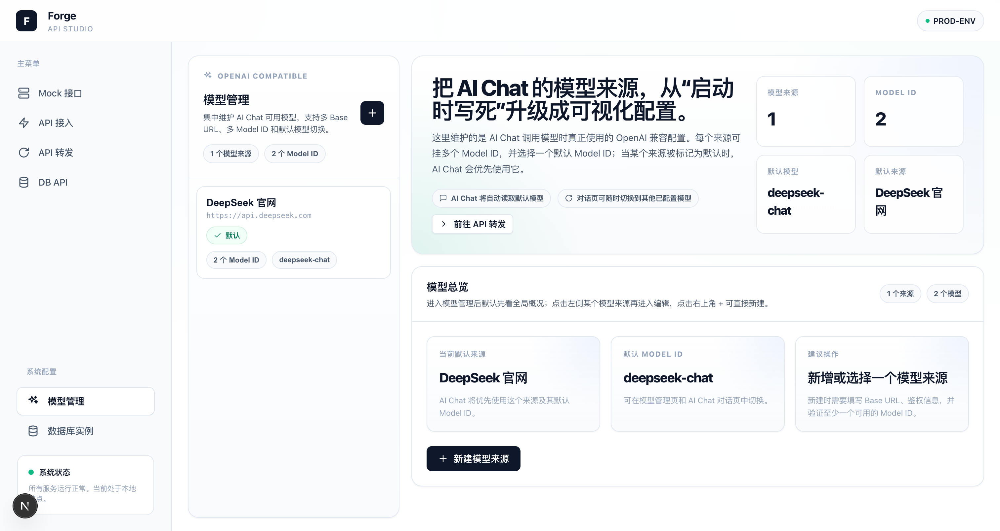
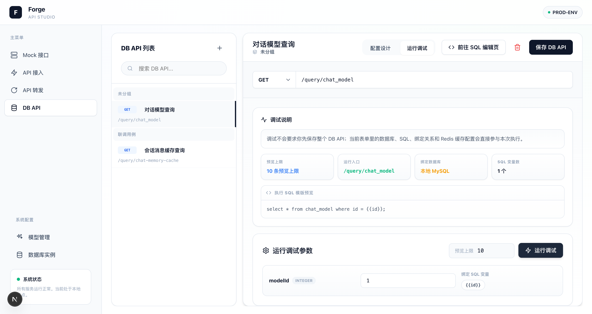

# API Forge - API 接口管理与研发辅助平台

API Forge 是一款专为开发者打造的全栈式 API 研发辅助平台。它不仅提供了强大的 **Mock API** 能力，还集成了类似 Postman 的 **API 接入 (Client)** 功能，以及极具特色的 **API 转发 (Forwarding)** 与**参数绑定**逻辑，旨在解决前后端并行开发中的联调痛点。


## 🌟 核心特性

- **🚀 Mock API 管理**
  - 支持 RESTful 接口全量配置：Method, Path, Headers, Query, Body。
  - 支持**流式响应 (Streaming)**，模拟大文件或实时数据传输。
  - 智能匹配算法，精准识别动态路径参数 (`/api/user/:id`)。
  
- **🛠 API 接入 (API Client)**
  - **配置模式 (Design)**：定义接口结构、参数类型。
  - **调试模式 (Run)**：基于配置自动生成表单，快速进行 proxy 请求。
  - 内置代理服务，彻底解决浏览器跨域 (CORS) 困扰。

- **🔄 API 转发与参数映射 (Forwarding)**
  - 允许建立“虚拟路径”并将其映射至已有的 Mock 或真实接口。
  - **参数绑定**：支持将虚拟接口的自定义入参映射到目标接口的指定字段。
  - 目标接口若为 `POST / PUT / PATCH` 且带 `application/json` 请求体，参数绑定面板会同时展示 `Query` 与 `Body` 字段，可直接把转发入参绑定到目标请求体路径。
  - 参数绑定支持“固定静态值”模式；选中后会出现输入框，用于填写要透传到目标接口的固定值。
  - **Redis 结果缓存**：默认关闭；开启后需选择已接入的 Redis 数据源，并配置缓存 Key 规则与过期时间。
  - 缓存 Key 按 `接口ID:输入规则` 拼接，规则支持 `{{param}}`、`{{user.id}}`、`{{$.user.id}}`、`{{items[0].sku}}` 等从接口入参中取值。
  - 适用于构建统一网关入口或适配已有接口体系。

- **🗃 DB API（SQL 数据接口）**
  - 新增独立的 `DB API` 工作台，可像 API 转发一样配置“接口路径 + 请求方法 + 入参定义”。
  - 支持选择已接入的 `MySQL / PostgreSQL` 数据源，并在页面内直接执行 SQL 调试。
  - SQL 模板支持 `{{variable}}` 占位，页面会自动识别变量并提供“接口入参 / 固定静态值”绑定面板。
  - 调试执行采用参数化查询，返回结果集、预览 SQL、绑定明细、Redis 缓存状态，便于联调与排查。
  - 独立 SQL 编辑页支持“库表结构查看 + SQL 编写 + 运行预览”，主配置页则专注于接口入参、变量绑定、缓存配置与运行调试。
  - 主页面运行调试区已升级为 `调试说明 → 运行调试参数 → 运行调试结果` 的工作流布局，并内置 SQL 模板预览、参数绑定提示、结果清除与分栏预览。
  - 保存后可通过 `/query/...` 等配置路径直接访问真实数据接口。

- **🌐 直接运行时访问（Runtime Route Dispatch）**
  - 已支持通过配置的接口路径直接访问 `API 转发` 与 `DB API`，无需再走页面内调试接口。
  - `API 转发` 示例：`http://localhost:3000/forward/b2bgateway/auth?appkey=1&appSecret=2`
  - `DB API` 示例：`http://localhost:3000/query/chat_model?modelId=1`
  - 运行时会自动解析 `Path Params / Query / application/json / 表单参数`，并复用页面中的参数绑定规则。

- **🧠 高级编排工作流（测试转发）**
  - 在 API 转发配置页新增“高级编排”工作流编辑器，支持 `数据筛选 / 字段映射 / 字段新增 / 排序限制` 节点串联。
  - 支持节点拖拽排序、单节点调试、整条编排试运行，并在页面内实时预览工作流配置 JSON。
  - 字段新增支持模板表达式：`{{字段}}`、`{{入参key}}`、`{{$param.key}}`（如 `{{bbb}} * 0.1`）。
  - 针对对象数组（如 `data[]`）支持父子层级树展示与选择，父节点勾选自动联动子节点，部分勾选显示中间态。
  - 字段映射支持数组项属性重命名（如 `data[].age -> userAge`），直接改写数组对象字段，不会额外生成冗余数组。
  - 编排输入支持填写真实 API 入参并触发实际转发调用，基于真实返回数据继续后续编排。
  - 工作流支持一键保存，配置持久化到 API 转发表（`orchestration` 字段）。

- **🤖 AI Chat 编排助手**
  - 在“高级编排工作流”的“添加处理节点”栏最右侧新增 `AI Chat` 入口，可通过自然语言直接生成或修改工作流。
  - AI 会自动结合当前编排 scheme、节点格式、参数定义、参数绑定、接口 output 与体检问题生成最终配置。
  - 支持流式输出、自动应用到画布、改动摘要展示，以及“只修复体检报错”专项模式。
  - Prompt 已抽离到独立文件 `src/prompts/orchestration-ai-chat.md`，后端在调用时动态读取并注入上下文，便于后续单独维护和迭代。

- **🧩 模型管理（OpenAI Compatible）**
  - 左侧导航新增“模型管理”页，可集中维护 AI Chat 使用的模型来源。
  - 支持配置模型名称、`Base URL`、鉴权方式（无鉴权 / Bearer Token / 自定义 Header）、多个 `Model ID` 与默认 `Model ID`。
  - 新增 `Model ID` 时会立即发起真实可用性校验，校验失败不会加入列表；保存时不再要求额外做一次前置连接测试。
  - AI Chat 会自动读取默认模型来源；若配置了多个模型，也支持在对话页内临时切换。

- **🗄 数据库实例管理**
  - 左侧导航新增“数据库实例”页，统一管理 `MySQL / PostgreSQL / Redis` 实例。
  - 新增或编辑实例时，必须先通过真实连接验证后才能保存。
  - 支持进入实例详情页浏览结构对象，并在页面内执行只读 SQL / Redis 查询。
  - 详情页已按引擎区分展示：`MySQL / PostgreSQL` 保留结构浏览与表结构属性；`Redis` 仅保留只读查询控制台，不再展示结构浏览模块。

- **📦 环境变量与分组**
  - 支持接口按分组管理。
  - 分组级别**环境变量**支持 (`{{VAR}}`)，在 URL、Headers、Body 中自动替换。

- **🎨 极致视觉体验**
  - 全站升级为 Studio 风格 Light Theme，采用 Plus Jakarta Sans + JetBrains Mono 字体体系。
  - 统一图标系统、反馈 Toast、标签、按钮和卡片设计语言，提升整体一致性。
  - Mock / API Client / API Forward 三大工作台拥有一致的导航结构与更清晰的结果面板。

## ✨ 本次更新亮点

- **DB API 调试页体验升级**
  - 运行调试区改为自上而下的工作流结构：`调试说明 → 运行调试参数 → 运行调试结果`，更符合真实联调顺序。
  - “调试说明”区新增摘要信息卡，集中展示预览上限、运行入口、绑定数据库、SQL 变量数，并补充当前 SQL 模板预览。
  - “运行调试参数”区改为更紧凑的横向布局：左侧参数信息，中间输入框，右侧展示当前参数绑定到的 SQL 变量，减少纵向占用。
  - “运行调试结果”区补齐与 API 转发一致的 `清除结果` 按钮，支持快速清空结果、状态与耗时。

- **配置路径直连运行时修复**
  - 新增根级动态分发能力，`API 转发` 与 `DB API` 可直接通过配置路径对外访问。
  - 已支持如 `/forward/...`、`/query/...` 这样的真实调用入口，不再局限于编辑页内调试。
  - 直接访问时会自动复用现有参数绑定、Redis 缓存与运行逻辑，确保“调试结果”和“真实访问”行为一致。

- **数据库实例管理与详情页修复**
  - 新增数据库实例管理工作台，支持 MySQL / PostgreSQL / Redis 的连接配置、验证、保存与详情查看。
  - 连接信息支持脱敏显示，编辑页支持密码显隐切换。
  - 详情页已按引擎进一步收敛：MySQL / PostgreSQL 保留“结构浏览 + 表结构属性 + 查询控制台”，Redis 仅保留只读查询控制台，移除结构浏览模块。
  - 修复了查询控制台在空结果场景下的字段展示问题，SQL 空结果也会正确显示列头。
  - 修复了 PostgreSQL 结构读取逻辑，现支持读取非系统 schema 的真实表，并正确识别主键字段。
  - 修复了“第一次连接数据源成功、第二次进入详情读取结构失败”的问题；本地开发脚本已调整为 `next dev`，降低热更新导致的接口抖动。

- **API 转发 Redis 缓存上线**
  - API 转发编辑页新增 Redis 缓存配置区，默认关闭；无 Redis 数据源时禁止开启，并在页内直接提示先完成接入。
  - 开启后可选择 Redis 数据源、填写缓存 Key 规则、设置过期时间，并在编辑页实时预览最终 Key 前缀。
  - 调试执行链路已接入真实 Redis 写入，执行结果会在 `_meta.cache` 中返回本次写入的 Key、过期时间与成功状态。
  - 修复了 Redis 缓存写入失败问题，并补齐 `{{param}}` / JSONPath 风格入参解析。

- **模型管理与 AI Chat 模型切换上线**
  - AI Chat 已从“启动时写死 DeepSeek Key / Model”升级为“页面可配置 OpenAI Compatible 模型”。
  - 左侧菜单底部新增“模型管理”，默认先展示总览；可从右上角 `+` 新建模型来源，也可点左侧卡片进入编辑。
  - 新增模型时，`Model ID` 会在添加时立即校验可用性，通过后才加入列表；模型保存仅保留结构校验，不再重复做保存前连接测试。
  - 模型卡片信息层级已优化为左上对齐，模型名称与 `Base URL` 更易于快速浏览和比对。

- **AI 编排助手与 Prompt 独立管理**
  - 高级编排工作区新增 `AI Chat` 对话页，支持流式生成工作流配置、自动落画布、输出改动摘要。
  - 支持“只修复体检报错”模式，AI 会优先针对页面当前 error 问题进行最小改动修复。
  - AI Prompt 已从路由逻辑中抽离为独立模板文件 `src/prompts/orchestration-ai-chat.md`，通过占位符注入模式说明与动态上下文，后续可单独维护。

- **编排规则与体检系统增强**
  - `compute` 节点新增数组项字段写入支持，例如 `userlist[].sex` 可逐项生效。
  - `sort` 节点统一标准写法，明确拆分为 `arrayPath + sortField`，保存前自动规范化歧义路径。
  - 工作区顶部新增体检问题提示，支持点击问题直接定位对应节点。
  - AI Chat 生成配置后也会先经过同一套规范化与体检流程，再渲染到工作流画布中。

- **字段映射父子联动体验升级**
  - `map` 节点支持父级字段改名后，后续子级映射规则自动跟随新的路径空间。
  - 若先将 `datas -> userlist`，后续子级规则会优先基于 `userlist[].*` 继续配置，避免旧路径空间与新路径空间混用。
  - 调整父级目标字段后，后续子级规则可联动更新，减少手工同步成本。

- **Studio 级界面重构**
  - 重做全局 Header、Sidebar 与页面容器，统一色彩变量、圆角、阴影、动效和滚动条样式。
  - 新增 `src/components/Icons.tsx` 作为统一 SVG 图标入口，替换原先分散的 Emoji 图标。
  - 整体视觉从“工具页”升级为“工作台”，更适合日常联调与演示场景。

- **Mock 接口管理台升级**
  - 新增统计卡片、方法筛选、分组筛选、搜索栏与更清晰的空状态/加载态。
  - 列表项强化标签展示，支持更直观地识别分组、RESTful 路径、流式响应与延迟配置。
  - Mock 编辑弹窗补充字段校验与更清晰的分栏配置体验。
  - `POST application/json` 场景新增“JSON 请求体匹配”编辑器，支持 `表单视图 / 原始 JSON` 双向切换，便于像 Apifox / Postman 一样配置匹配条件。
  - Mock 匹配链路新增 JSON Body 精准匹配能力；空字符串、空对象、空数组字段会在匹配时自动忽略，便于只约束关键字段。

- **API 接入工作台升级**
  - 重构为“接口收藏夹 + 编辑/运行双模式 + 响应结果面板”的工作区布局。
  - 优化分组折叠、环境变量入口、运行参数填写区与响应状态展示。
  - 保存、创建、删除、请求执行等操作统一为页内反馈，不再依赖粗糙提示方式。
  - `POST / PUT / PATCH` 请求新增类 Postman / Apifox 的 JSON Body 编辑器；支持按字段编辑路径、类型、值，并实时同步到底层原始 JSON。
  - 运行调试时若未手动指定 `Content-Type`，系统会在 JSON Body 请求下自动补齐 `application/json`。

- **API 转发与编排体验升级**
  - API Forward 页面采用与 Client 一致的工作台布局，新增更清晰的目标接口绑定与参数映射样式。
  - 目标接口为 `POST application/json` 时，参数映射区会自动列出可绑定的请求体字段，并标记 `Body / Query` 来源。
  - 选择“固定静态值”后会立即出现输入框，填写的值会在实际转发调用时原样写入目标接口参数或请求体。
  - 运行调试面板与执行结果面板重做，方便直接验证转发链路。
  - 高级编排工作区补充统一图标、状态标签、底部数据预览 Tab 与更明确的节点编辑操作。

- **DB API 工作台上线**
  - 左侧导航新增 `DB API` 模块，整体布局延续现有 Studio 风格工作台。
  - 支持对 `MySQL / PostgreSQL` 数据源进行选择、SQL 模板编写、SQL 变量绑定与执行调试。
  - SQL 调试返回结果集之外，还会展示参数化后的预览 SQL 与最终变量绑定值。
  - 运行入口统一挂载在 `/db-api/*` 下，适合把只读 SQL 快速包装为可复用接口。

- **基础编辑器与弹窗组件统一**
  - `JsonEditor` 新增 JSON 有效性提示、格式化/压缩入口与更稳定的编辑容器。
  - `KeyValueEditor`、`ApiParamEditor`、`GroupVarsModal` 等组件同步完成视觉与交互统一。

## 🖥 功能演示区

### 1. Mock 接口工作台
- 适合快速创建本地联调接口、模拟 RESTful 路径、配置延迟与流式响应。
- 首页提供统计卡片、方法筛选、分组筛选、搜索与批量浏览能力。
- 进入编辑器后可分别配置基本信息、请求参数、响应数据与流式分片。
- 对于 `POST application/json`，可在“请求参数”页直接用 JSON 请求体匹配器按字段定义命中规则。

### 2. API 接入工作台
- 适合接入第三方 API、保存常用请求配置，并在页内直接运行调试。
- 左侧为接口收藏夹与分组入口，右侧为配置设计 / 运行调试双模式工作区。
- 响应面板会展示状态码、耗时与完整响应内容，适合接口验证与问题定位。
- JSON Body 支持表单化编辑与原始 JSON 双视图联动，更适合调试复杂 `application/json` 请求。

### 3. API 转发与编排工作台
- 适合搭建统一虚拟接口层，把入参映射到真实接口或 Mock 接口。
- 支持自定义入参定义、目标接口绑定、参数映射、固定值注入与结果回放。
- 当目标为 `POST application/json` 接口时，支持把转发入参或固定静态值直接写入目标请求体字段。
- 支持按转发接口配置 Redis 结果缓存，并根据接口入参动态拼接缓存 Key。
- 高级编排支持筛选、字段映射、字段新增、排序限制，并可在工作区实时预览执行结果。
- AI Chat 支持直接通过自然语言生成/修改编排，并可专项修复页面体检报错。

### 4. 模型管理工作台
- 适合统一维护 AI Chat 所依赖的 OpenAI Compatible 模型来源。
- 支持多来源、多 `Model ID`、默认模型切换，以及 Bearer / 自定义 Header 鉴权方式。
- 新增 `Model ID` 时会立即做可用性校验，确保真正能被 AI Chat 调用。

### 5. DB API 工作台
- 适合把常用只读 SQL 封装成可复用接口，对外暴露统一查询入口。
- 支持定义接口入参、自动识别 SQL 变量、配置“入参绑定 / 固定静态值”并直接联调数据库。
- 主配置页专注于接口定义、入参绑定、运行调试与 Redis 结果缓存；SQL 编写、库表结构查看与预览则进入独立编辑页。
- 调试模式会同时展示结果数据、预览 SQL、变量绑定来源、缓存状态，并把数据预览与接口返回分栏展示，方便快速确认执行链路。

## 🔌 常用访问路径

### 页面入口
- `http://localhost:3000/`：Mock 接口工作台
- `http://localhost:3000/api-client`：API 接入工作台
- `http://localhost:3000/api-forward`：API 转发工作台
- `http://localhost:3000/db-api`：DB API 工作台
- `http://localhost:3000/model-management`：模型管理
- `http://localhost:3000/database-instances`：数据库实例管理

### 运行时接口入口
- `Mock`：`/mock/...`
- `API 转发`：`/forward/...`
- `DB API`：`/query/...`

示例：

```bash
curl "http://localhost:3000/forward/b2bgateway/auth?appkey=1&appSecret=2"
curl "http://localhost:3000/query/chat_model?modelId=1"
```

### 6. 推荐演示路径
```text
Mock 接口定义 -> API 接入调试 -> API 转发绑定 -> DB API SQL 封装 -> 高级编排处理 -> 模型管理配置默认模型 -> AI Chat 自然语言改编排 -> 数据库实例查询验证 -> 输出最终响应
```

### 7. 适合在 README 中补充的截图位置
- 首页 Mock 接口总览页
- API Client 的运行调试界面
- API Forward 的参数映射面板
- 高级编排工作流画布与底部输出预览区
- 模型管理总览页 / 模型来源编辑页
- DB API 的 SQL 绑定与调试界面

## 📸 截图素材清单

如果你准备把项目作为作品集或 GitHub 展示页，建议优先补这几张图：

| 截图名称 | 建议页面 | 建议展示内容 |
| --- | --- | --- |
| `mock-dashboard.png` | Mock 首页 | 统计卡片、搜索筛选、接口列表标签 |
| `mock-editor.png` | Mock 编辑弹窗 | 基本信息 + 请求配置 + 响应配置 |
| `api-client-runner.png` | API Client | 左侧收藏夹、顶部请求栏、右侧响应结果 |
| `api-forward-binding.png` | API Forward | 自定义入参、目标接口绑定、参数映射 |
| `orchestration-workspace.png` | 高级编排工作区 | 节点画布、右侧节点配置、底部数据预览 |
| `orchestration-output.png` | 编排调试结果 | 输入数据 / 配置 JSON / 输出结果的联动展示 |
| `model-management-overview.png` | 模型管理 | 总览卡片、默认模型、模型来源列表 |
| `model-management-editor.png` | 模型管理编辑页 | Base URL、鉴权、Model ID 校验与默认模型配置 |
| `database-instances-overview.png` | 数据库实例 | 实例列表、统计卡片、空态 / 总览 |
| `database-instance-detail.png` | 数据库实例详情 | SQL 结构浏览 + 表结构属性 / Redis 只读查询控制台 |
| `db-api-workbench.png` | DB API | 数据源选择、SQL 模板、变量绑定与调试结果 |

建议截图规范：
- 统一使用浅色主题与相同浏览器窗口尺寸。
- 截图时尽量保留完整 Header 和 Sidebar，强化“工作台”感。
- 示例数据尽量使用真实字段名，例如 `userId`、`price`、`status`、`data[].age`。

### 素材目录

- 所有 README 配套截图统一存放在 `docs/screenshots/`
- 当前已补齐 Mock、API Client、API Forward、高级编排、模型管理、数据库实例与 DB API 的核心展示图

### 预览示例

| 模块 | 预览 |
| --- | --- |
| Mock 工作台 |  |
| API 转发编排输出 |  |
| 模型管理 |  |
| DB API 调试台 |  |

## 🛠 技术栈

### Frontend
- **Framework**: Next.js 16 (App Router)
- **Library**: React 19
- **Language**: TypeScript
- **Editor**: Monaco Editor (`@monaco-editor/react`)
- **Styling**: CSS Modules + Modern CSS Variables

### Backend
- **Server**: Next.js API Routes (Serverless ready)
- **Database**: SQLite (powered by `better-sqlite3`)
- **Routing**: `path-to-regexp` (与 Express 路由规则一致)

## 🚀 快速开始

### 环境依赖
- Node.js 18.x 或更高版本
- npm 或 yarn

### 1. 安装依赖
```bash
npm install
```

### 2. 启动开发服务器
```bash
npm run dev
```
打开浏览器访问 [http://localhost:3000](http://localhost:3000) 即可开始使用。

> 说明：当前开发脚本使用 `next dev`，避免本地开发态下数据库相关动态接口在重复进入详情页时出现热更新抖动。

### 2.1 AI Chat 与模型配置
如需启用高级编排中的 AI Chat，请先准备一个兼容 OpenAI Chat Completions 的模型服务（例如 DeepSeek），然后：

```bash
cp .env.example .env.local
```

启动项目后进入左侧菜单的“模型管理”页面完成配置：

- 填写模型名称与 `Base URL`
- 选择鉴权方式并填写 Token / Header
- 添加至少一个 `Model ID`（添加时会立即校验可用性）
- 选择默认 `Model ID`
- 如需让 AI Chat 默认使用该来源，可勾选“设为默认”

当前示例可参考 DeepSeek OpenAI Compatible 接口：

```bash
Base URL: https://api.deepseek.com
Model ID: deepseek-chat
```

### 3. 项目打包与部署
```bash
npm run build
npm start
```

## 📂 项目结构
- `/src/app`: 页面路由与主逻辑
- `/src/app/api`: 服务端 API Routes
- `/src/app/[...path]/route.ts`: 根级运行时分发器，负责直连 `API 转发 / DB API`
- `/src/components`: 可复用的 UI 组件（编辑器、弹窗等）
- `/src/lib`: 核心逻辑（数据库操作、变量解析、匹配引擎）
- `/src/lib/api-forward-runtime.ts`: API 转发运行时执行器
- `/src/lib/db-api.ts`: DB API 匹配、SQL 编译与执行逻辑
- `/src/prompts`: AI Prompt 模板文件（支持独立维护与动态上下文注入）
- `/.agents/skills`: 本地设计/开发辅助技能配置

## 🧪 编排示例

下面是一段适合放在 README 或演示文档里的高级编排示例配置：

```json
{
  "nodes": [
    {
      "id": "filter_1",
      "type": "filter",
      "label": "保留核心字段",
      "order": 0,
      "config": {
        "mode": "include",
        "fields": [
          "code",
          "message",
          "data[].id",
          "data[].name",
          "data[].age",
          "data[].price"
        ]
      }
    },
    {
      "id": "map_1",
      "type": "map",
      "label": "字段重命名",
      "order": 1,
      "config": {
        "mappings": [
          { "from": "data[].age", "to": "userAge" },
          { "from": "data[].price", "to": "amount" }
        ]
      }
    },
    {
      "id": "compute_1",
      "type": "compute",
      "label": "新增折后价",
      "order": 2,
      "config": {
        "computations": [
          {
            "field": "data[].discountPrice",
            "expression": "{{amount}} * 0.9"
          }
        ]
      }
    },
    {
      "id": "sort_1",
      "type": "sort",
      "label": "按年龄排序并限制数量",
      "order": 3,
      "config": {
        "arrayPath": "data",
        "sortField": "userAge",
        "order": "desc",
        "limit": 10
      }
    }
  ]
}
```

这个示例展示了完整链路：
- 先保留需要的字段
- 再重命名数组对象属性
- 然后用表达式生成计算字段
- 最后对结果集排序并限制输出条数

## 📝 许可证
MIT License
